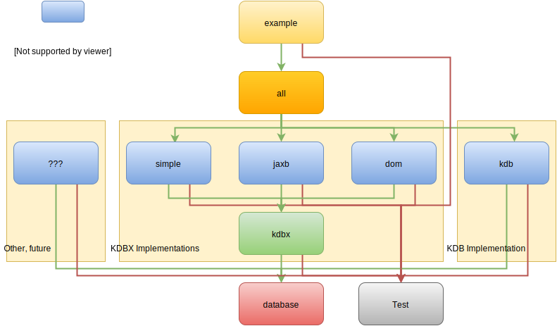

# KeePassJava2

A Java 7 API for databases compatible with the renowned [KeePass](http://keepass.info) password
safe for Windows.

Features to date:

- Read and write KeePass 2.x format
- Keepass 2.x Password and Keyfile Credentials
- Read KeePass 1.x format (Rijndael only)
- *No* requirement for JCE Policy Files
- Android compatible
- Interfaces for Database, Group and Entry allow compatible addition of other formats

It is licensed under the Apache 2 License and is currently usable.

    The work is provided on an "AS IS" BASIS, WITHOUT
    WARRANTIES OR CONDITIONS OF ANY KIND, either express or
    implied, including, without limitation, any warranties
    or conditions of TITLE, NON-INFRINGEMENT, MERCHANTABILITY,
    or FITNESS FOR A PARTICULAR PURPOSE.

    You are solely responsible for determining the appropriateness
    of using or redistributing the Work and assume any risks
    associated with Your exercise of permissions under this License.

 (see [license](#license))

## <a name="mvn">Maven Coordinates</a>

The composite POM is

        <groupId>org.linguafranca.pwdb</groupId>
        <artifactId>keepassjava2</artifactId>
        <version>2.1.0</version>
        
 at Maven Central. There are also separate POMs for the various modules. The module structure is illustrated below
 under [Build from Source](#bfs).
  
 Snapshot builds at [Sonatype OSS](https://oss.sonatype.org/content/groups/public/).

## Java Version

It is written for Java 1.7.

## Quick Start

Password databases are modelled as a three layer abstraction. 

A *Database* is a collection of records whose physical representation needs only to be capable of rendering as a stream. *Entries* hold the information of value in the database and *Groups* allow the structuring of entries into collections, just like a folder structure. 

The Database has a root group and by following sub-groups of the root group the tree structure of the database can be navigated. Entries belong to groups. Entries can be moved between groups and groups can also be moved between groups. However, entries and groups created in one database cannot be moved to another database without being converted: Database.newEntry(entryToCopy), Database.newGroup(groupToCopy).

The class Javadoc on Interface classes
[Database](database/src/main/java/org/linguafranca/pwdb/Database.java), 
[Group](database/src/main/java/org/linguafranca/pwdb/Group.java) and 
[Entry](database/src/main/java/org/linguafranca/pwdb/Entry.java) describe
how to use the methods of those classes to create and modify entries. These classes
provide the basis of all implementations of the various database formats,
initially KDB and KDBX 3.1 (KeePass 2) file formats, subsequently, potentially, others.

The class [QuickStart.java](example/src/main/java/org/linguafranca/pwdb/kdbx/QuickStart.java) provides some
illustrations of operations using the Database, Group and Entry interfaces.

### KeePassJava2 and KeePass

This project is so named by kind permission of Dominik Reichl the author of KeePass. There
is no formal connection with that project.

It has always been the intention to support other specific password database implementations.
Hence the creation of abstract Database interfaces rather than following the KeePass model
exactly.

KeePass is in effect defined by the code that Dominik writes to create and maintain the project.
Hence there are no definitive specification of KeePass files other than that code. For the sake of
clarification and my own satisfaction I have written about my understanding of KeePass formats in the following locations:

1. The Javadoc header to [KdbxSerializer](kdbx/src/main/java/org/linguafranca/pwdb/kdbx/stream_3_1/KdbxSerializer.java) describes KDBX stream formatting.
2. The XSD Schema [KDBX.3.1.xsd](KDBX.3.1.xsd) documents my understanding of the Keepass XML, and also my lack of understanding, in parts.
3. [This graphic](Format Diagram.svg) illustrates KDBX 3.1 stream format and also illustrates proposals for the revised KDBX 4.0 format. 

## Dependencies

Aside from the JRE the API depends on:

- [Google Guava](https://github.com/google/guava/wiki) ([Apache 2 license](https://github.com/google/guava/blob/master/COPYING)).
- [Apache Commons Codec](https://commons.apache.org/proper/commons-codec/) ([Apache 2 license](http://www.apache.org/licenses/LICENSE-2.0)).
- [Spongy Castle](https://rtyley.github.io/spongycastle/) which is a repackaging for Android of [Bouncy Castle](https://www.bouncycastle.org/java.html) ([Apache 2 license](https://www.bouncycastle.org/licence.html)).

The Simple XML implementation additionally depends on:

- [Simple XML Serialisation Framework](http://simple.sourceforge.net/) ([Apache 2 license](http://www.apache.org/licenses/LICENSE-2.0)).
- [Faster XML Aalto](https://github.com/FasterXML/aalto-xml) ([Apache 2 license](http://www.apache.org/licenses/LICENSE-2.0.txt)).

It also depends on SLF4J and Junit for tests.

## Build from Source

Included POM is for Maven 3.

### <a name="bfs">Module Structure</a>

There are rather a lot of modules, this is in order to allow loading of minimal necessary functionality. The module dependencies are illustrated below.

Each module corresponds to a Maven artifact. The GroupId is `org.linguafranca.pwdb`. The version id is as noted [above](#mvn).

<table>
<thead>
<tr><th>Module</th><th>ArtifactId</th><th>Description</th></tr>
</thead>
<tbody>
<tr><td><a href="database">database</a></td><td>database</td><td>Base definition of the Database APIs.</td></tr>
<tr><td><a href="">example</a></td><td>example</td><td>Worked examples of loading, saving, splicing etc. using the APIs</td></tr>
<tr><td><a href="test">test</a></td><td>test</td><td>Shared tests to assess the viability of the implementation.</td></tr>
<tr><td><a href="all">all</a></td><td><strong>KeePassJava2</strong></td><td>This is the main KeePassJava2 Maven dependency. Provides a route to all artifacts (other than test and examples) via transitive dependency.</td></tr>
<tr><td><a href="kdb">kdb</a></td><td>KeePassJava2-kdb</td><td>An implementation of the Database APIs supporting KeePass KDB format.</td></tr>
<tr><td><a href="kdbx">kdbx</a></td><td>KeePassJava2-kdbx</td><td>Provides support for KDBX streaming and security.</td></tr>
<tr><td><a href="simple">simple</a></td><td>KeePassJava2-simple</td><td>A Simple XML Platform implementation of KDBX. Could be useful for Android.</td></tr>
<tr><td><a href="jaxb">jaxb</a></td><td>KeePassJava2-jaxb</td><td>A JAXB implementation of KDBX. Probably not useful for Android. The generated class
bindings might be useful for building other interfaces.</td></tr>
<tr><td><a href="dom">dom</a></td><td>KeePassJava2-dom</td><td>A DOM based implementation of KDBX. Being DOM based it is rather slow, but 
messes less with existing content than the other two implementations. Known to work on Android.</td></tr>
</tbody>
</table>

Why are there so many implementations for KDBX? Well, the DOM implementation came first, because of the fact that it can 
load and save stuff that the implementation doesn't specifically know about. But it is very slow.

Then came the JAXB implementation, but 
belatedly it seems that Android support is in question. So latterly the Simple implementation. That's probably enough 
KDBX implementations.

### Gradle

If you prefer Gradle the automatic conversion `gradle init` converts the POM successfully, however you will 
need to add something like the following to the `build.gradle` for the JAXB module, so that the generated sources
 get compiled correctly:

    sourceSets {
      main {
        java {
          srcDirs = ['src/main/java', 'src/generated/java']
        }
        resources {
          srcDirs = ['src/main/resources']
        }
      }
      test{
        java {
          srcDirs = ['src/test/java']
        }
        resources {
          srcDirs = ['src/test/resources']
        }
      }
    }
    
You'll find it in [gradle-source-sets.txt](jaxb/gradle-source-sets.txt) in the root of the jaxb module.

## Change Log

In [this file](./CHANGELOG.md).

## Acknowledgements

Many thanks to Pavel Ivanov [@ivanovpv](https://github.com/ivanovpv) for 
his help with Android and Gradle compatibility issues.

##  <a name="license">License</a>

Copyright (c) 2016 Jo Rabin

Licensed under the Apache License, Version 2.0 (the "License");
you may not use this file except in compliance with the License.
You may obtain a copy of the License at

http://www.apache.org/licenses/LICENSE-2.0

Unless required by applicable law or agreed to in writing, software
distributed under the License is distributed on an "AS IS" BASIS,
WITHOUT WARRANTIES OR CONDITIONS OF ANY KIND, either express or implied.
See the License for the specific language governing permissions and
limitations under the License.