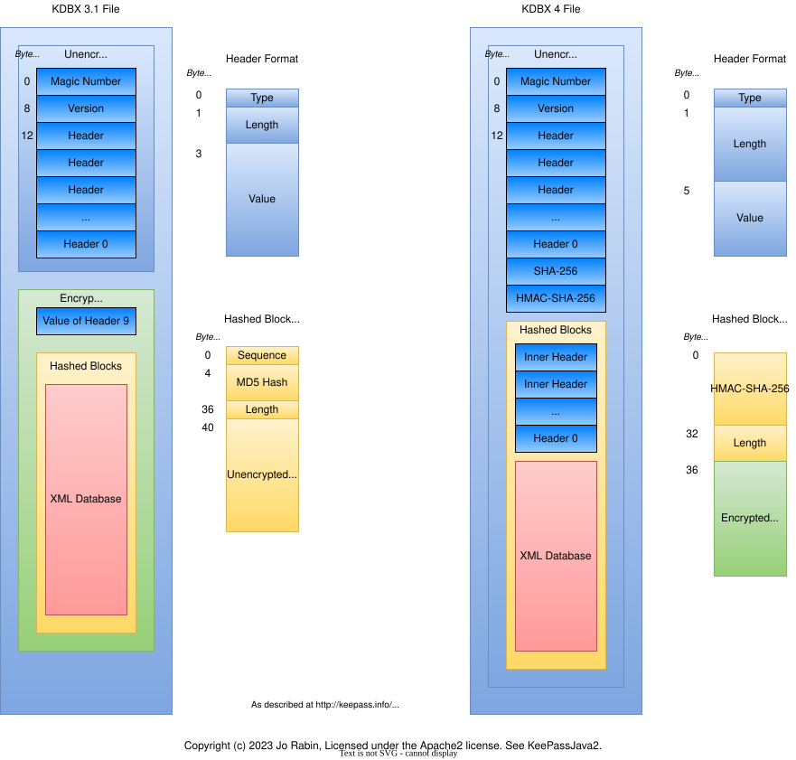
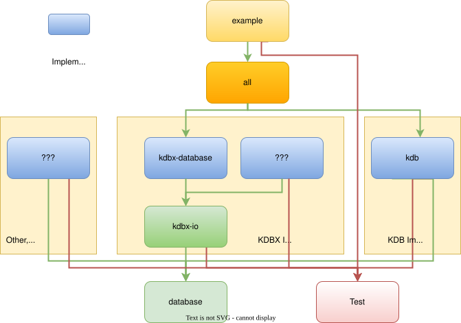

# KeePassJava2

  

  

  

  

Java 17 API (from version 3.1.0 upwards) for password databases compatible with the renowned [KeePass](http://keepass.info) password
safe for Windows. This is a "headless" implementation - if you want something with a UI
then [KeePassXC](https://keepassxc.org/) and [KeePassDX](https://www.keepassdx.com/) could
be just the things for you.

Features to date:

- Read and write KeePass 2.x format (KDBX file formats V3.1, V4 and V4.1)
- Keepass 2.x Password and Keyfile Credentials
- Pluggable memory storage and protection strategy
- Read KeePass 1.x format (KDB format, Rijndael only)
- *No* requirement for JCE Policy Files
- Android compatible
- Interfaces for Database, Group and Entry allow compatible addition of other formats

It is licensed under the Apache 2 License and is currently usable.

    The work is provided on an "AS IS" BASIS, WITHOUT
    WARRANTIES OR CONDITIONS OF ANY KIND, either express or
    implied, including, without limitation, any warranties
    or conditions of TITLE, NON-INFRINGEMENT, MERCHANTABILITY,
    or FITNESS FOR A PARTICULAR PURPOSE.

    You are solely responsible for determining the appropriateness
    of using or redistributing the Work and assume any risks
    associated with Your exercise of permissions under this License.

 (see [license](#license))

## Current Status

The current code is version 3.0.0 - released to Maven October 2026. This is on branch `v3-master`,
with development on branch `v3-develop`. See [Build from Source](#build-from-source).
Upgrade to V3 requires minor changes to V2 code, see [Upgrading from 2.x to 3.0](#upgrading-from-2x-to-30)
and [Upgrading from 3.0 to 3.1](#upgrading-from-30-to-31).

Version 2 is still maintained for now, with bug and security fixes. Its current release is 2.2.6,
on branch `master`, with development on branch `develop`.

Key updates relative to 2.x
- Java 11 (Java 17 from 3.1.0)
- Pluggable (protected) data storage model
- File format version 4 support - with Argon2
- Removal of SimpleXML, JAXB and DOM database implementations
- Removed generics on database classes
- Refactor modules and packages
- Updated keyfile support
- Updated dependencies

See the [changelog](CHANGELOG.md) for more details.

### Upgrading from 2.x to 3.0

Upgrading from 2.x needs some, mostly minor, changes to your code and build:

- **Java 11** is required (Java 17 from 3.1).
- **One KDBX implementation.** The Jackson implementation is now *the* KDBX database, `KdbxDatabase` (was `JacksonDatabase`). The Simple, JAXB and DOM implementations are removed.
- **No generics on the database classes.** `Database`, `Group`, `Entry` and so on are no longer generic, so declarations such as `Database<?,?,?,?>` become plain `Database`.
- **Renamed classes,** for example `KdbxCreds` is now `KdbxCredentials`.
- **New artifacts** (group `org.linguafranca.pwdb`):

  | 2.x | 3.x |
  |---|---|
  | `KeePassJava2-jackson` | `KeePassJava2.kdbx.database` |
  | `KeePassJava2-kdbx` | `KeePassJava2.kdbx.io` |
  | `KeePassJava2-kdb` | `KeePassJava2.kdb` |
  | `database` | `database` |
  | `KeePassJava2` (all) | `KeePassJava2` (KDBX and KDB) |
  | `KeePassJava2-simple`, `-jaxb`, `-dom` | removed |

- **New Java module names** ([issue 93](https://github.com/jorabin/KeePassJava2/issues/93)), deliberately different from 2.x:
  `org.linguafranca.pwdb.database`, `org.linguafranca.pwdb.kdb`, `org.linguafranca.pwdb.kdbx.io`,
  `org.linguafranca.pwdb.kdbx.database` and `org.linguafranca.pwdb.all`. Update your `requires` clauses.

See the [Quick Start](#quick-start) for a worked example in the version 3 API.

### Upgrading from 3.0 to 3.1

- Java 17 or later is required.
- Times on `Entry` and `Group` are `java.time.Instant` rather than `java.util.Date`. Where code needs a `Date`, convert at the call:

      Date created = Date.from(entry.getCreationTime());
      entry.setExpiryTime(expiryDate.toInstant());

- `load` and `save` are deprecated in favour of `read` and `write`, which leave the stream open, so close it yourself:

      try (InputStream inputStream = Files.newInputStream(path)) {
          database = KdbxDatabase.read(credentials, inputStream);
      }

## Maven Coordinates

### Release

The POM for the last release (3.0.0), Java 11 compatible, is

        <groupId>org.linguafranca.pwdb</groupId>
        <artifactId>KeePassJava2.kdbx.database</artifactId>
        <version>3.0.0</version>

at Maven Central. This provides access to the KDBX database implementation. There is also a
composite POM that provides access to the KDBX and KDB implementations:

        <groupId>org.linguafranca.pwdb</groupId>
        <artifactId>KeePassJava2</artifactId>
        <version>3.0.0</version>

For the last 2.x release, see branch [`master`](https://github.com/jorabin/KeePassJava2/tree/master).

### Snapshot

Snapshot builds are published to the Maven Central snapshot repository, `https://central.sonatype.com/repository/maven-snapshots/`, which deletes them after about 90 days. The next release will be 3.1.0-SNAPSHOT (on branch `v3-develop`), not yet published:

        <groupId>org.linguafranca.pwdb</groupId>
        <artifactId>KeePassJava2</artifactId>
        <version>3.1.0-SNAPSHOT</version>
 
with appropriate `<repositories>` entry, like:

      <repositories>
         <repository>
            <id>central-portal-snapshots</id>
            <url>https://central.sonatype.com/repository/maven-snapshots/</url>
            <releases>
                 <enabled>false</enabled>
            </releases>
            <snapshots>
                <enabled>true</enabled>
            </snapshots>
         </repository>
      </repositories>
 
 The module structure is illustrated below
 under [Build from Source](#build-from-source).

## Java Version

Versions 3.1.0 onwards require Java 17. Version 3.0.0 requires Java 11. From version 2.2 Java 1.8 is required. Earlier versions require Java 1.7.

## Quick Start

Create credentials for the password vault in question, then read the database from an input stream:

      KdbxCredentials credentials = new KdbxCredentials("123".getBytes());
      Database database;
      try (InputStream inputStream = getClass().getClassLoader().getResourceAsStream("test1.kdbx")) {
          database = KdbxDatabase.read(credentials, inputStream);
      }

and write it to an output stream:

      try (OutputStream outputStream = Files.newOutputStream(Path.of("test1.kdbx"))) {
          database.write(credentials, outputStream);
      }

> From 3.1.0 `read` and `write` leave the stream open, so whoever opens a stream closes it, as above.
`load` and `save`, which close the stream they are given, are deprecated
(see [issue 109](https://github.com/jorabin/KeePassJava2/issues/109)).

> In the past there were a number of different database implementations, at present there
are two, one for KDBX (`KdbxDatabase` - previously called `JacksonDatabase`, because it uses Jackson for XML serialization)
and one to support the KeePass V2 KDB format (`KdbDatabase`).

### Storing Passwords

There are numerous well-understood problems
with storing passwords as Strings in Java. See [this discussion](./PropertyValueProtection.md) about the
KeePassJava2 approach to storing passwords.

### Discussion

Password databases are modelled as a three layer abstraction. 

A *Database* is a collection of records whose physical representation needs only to be capable 
of rendering as a stream. *Entries* hold the information of value in the database and *Groups* 
allow the structuring of entries into collections, just like a folder structure. 

The Database has a root group and by following subgroups of the root group the tree structure of 
the database can be navigated. Entries belong to groups. Entries can be moved between groups and groups 
can also be moved between groups. However, entries and groups created in one database cannot be moved to 
another database without being converted: 

    database.newEntry(entryToCopy);
    database.newGroup(groupToCopy);

The class Javadoc on Interface classes
[Database](http://javadoc.io/page/org.linguafranca.pwdb/database/latest/org/linguafranca/pwdb/Database.html), 
[Group](http://javadoc.io/page/org.linguafranca.pwdb/database/latest/org/linguafranca/pwdb/Group.html) and 
[Entry](http://javadoc.io/page/org.linguafranca.pwdb/database/latest/org/linguafranca/pwdb/Entry.html) describe
how to use the methods of those classes to create and modify entries. These classes
provide the basis of all implementations of the various database formats,
KDBX 3.1, 4 and 4.1 (KeePass 2) as well as KDB (KeePass 1), file formats.

The class [QuickStart.java](example/src/main/java/org/linguafranca/pwdb/kdbx/QuickStart.java) provides some
illustrations of operations using the Database, Group and Entry interfaces.

### KeePassJava2 and KeePass

This project is so named by kind permission of Dominik Reichl the author of KeePass. There
is no formal connection with that project.

It has always been the intention to support other specific password database implementations.
Hence, the creation of abstract Database interfaces rather than following the KeePass model
exactly.

KeePass is in effect defined by the code that Dominik writes to create and maintain the project and
[KDBX File Format Specification](https://keepass.info/help/kb/kdbx.html) describes the file format. There 
is also a discussion of the [differences between KDBX version 3.1 and version 4](https://keepass.info/help/kb/kdbx_4.html).
Additionally, there is a discussion of the [enhancements in KDBX 4.1](https://keepass.info/help/kb/kdbx_4.1.html), as well
as a discussion of [Key Files](https://keepass.info/help/base/keys.html#keyfiles). While preparing release 2.2.3 I found [this XSD](https://keepass.info/help/download/KDBX_XML.xsd) at the
KeePass site.

Massive credit also to the folks over at [KeePassXC](https://keepassxc.org/) who wrote some 
[documentation](https://github.com/keepassxreboot/keepassxc-specs) about their understanding of various format things. Also, this is a 
useful [discussion/investigation](https://github.com/scubajorgen/KeepassDecrypt) of the KDBX format.

For the sake of
clarification and my own satisfaction I have written about my understanding of 
KeePass formats in the following locations:

1. The Javadoc header to [KdbxSerializer](http://javadoc.io/page/org.linguafranca.pwdb/KeePassJava2-kdbx/latest/org/linguafranca/pwdb/kdbx/stream_3_1/KdbxSerializer.html) describes KDBX stream formatting.
2. The XSD Schema [KDBX.4.1.xsd](./XSD/KDBX.4.1.xsd) documents my understanding of the Keepass XML, and also my 
   lack of understanding, in parts. 
3. The following graphic illustrates KDBX 3.1 and 4 file formats:

## Database Implementations

KeePass - or more specifically its file format KDBX - is an XML based format, so one of the main tasks
is serializing and deserializing XML. Over time (KeePassJava2 was originally released in 2014) approaches
to Java and XML have been a bit mysterious. However, Jackson has now been chosen as the 
underlying framework for implementation of KeePassJava2. From 3.0.0 a single KDBX implementation is available.

Aside from dependencies on underlying frameworks, different implementations have varying characteristics, primarily speed. This is assessed
by [this test](https://github.com/jorabin/KeePassJava2/blob/master/example/src/main/java/org/linguafranca/pwdb/kdbx/OpenDbExample.java) in the module `examples`.

## Dependencies

Aside from the JRE, at release 3.0.0, the API depends on:

- [Google Guava](https://github.com/google/guava/wiki) ([Apache 2 license](https://github.com/google/guava/blob/master/COPYING)).
- [Apache Commons Codec](https://commons.apache.org/proper/commons-codec/) ([Apache 2 license](http://www.apache.org/licenses/LICENSE-2.0)).
- [Bouncy Castle](https://github.com/bcgit/bc-java/blob/master/LICENSE.html) ([MIT License](https://github.com/bcgit/bc-java/blob/master/LICENSE.html)).
- [Jackson XML](https://github.com/FasterXML/jackson-dataformat-xml) ([Apache 2 license](http://www.apache.org/licenses/LICENSE-2.0))
- [Woodstox](https://github.com/FasterXML/woodstox) ([Apache 2 license](http://www.apache.org/licenses/LICENSE-2.0))

It also depends on SLF4J, logback and JUnit 5 for tests.

## Build from Source

Included POM is for Maven 3.

It must be built using Java 17 or later (JDK 17+). It compiles with `--release 17`, so the jars it builds run on Java 17 whichever JDK builds them.

### Module Structure

There are rather a lot of modules, this is in order to allow loading of minimal necessary functionality. The module dependencies are illustrated below.

Each module corresponds to a Maven artifact. The GroupId is `org.linguafranca.pwdb`. The version id is as noted [above](#maven-coordinates).

<table>
<thead>
<tr><th>Module</th><th>ArtifactId</th><th>JavaDoc<th>Description</th></tr>
</thead>
<tbody>

<tr><td><a href="database">database</a></td><td>database</td>
<td>

</td>
<td>Base definition of the Database APIs.</td></tr>
<tr><td><a href="">example</a></td><td>example</td>
<td></td>
<td>Worked examples of loading, saving, splicing etc. using the APIs</td></tr>

<tr><td><a href="all">all</a></td><td><strong>KeePassJava2</strong></td>
<td>(no JavaDoc)</td>
<td>This is the main KeePassJava2 Maven dependency. Provides a route to all artifacts (other than test and examples) via transitive dependency.</td></tr>

<tr><td><a href="kdb">kdb</a></td><td>KeePassJava2-kdb</td>
<td></td>
<td>An implementation of the Database APIs supporting KeePass KDB format.</td></tr>

<tr><td><a href="kdbx-io">kdbx-io</a></td><td>KeePassJava2-kdbx-io</td>
<td></td>
<td>Provides support for KDBX streaming and security.</td></tr>

<tr><td><a href="kdbx-database">kdbx-database</a></td><td>KeePassJava2-kdbx-database</td>
<td></td>
<td>Provides support for KDBX data access and memory protection.</td></tr>

<tr><td><a href="basic">basic</a></td><td>basic</td>
<td></td>
<td>A basic lightweight database implementation. Has memory protection.</td></tr>
</tbody>
</table>

### Gradle

If you prefer Gradle the automatic conversion `gradle init` has been known to convert the POM successfully.

## Change Log

In [this file](./CHANGELOG.md).

## Acknowledgements

Many thanks to Pavel Ivanov [@ivanovpv](https://github.com/ivanovpv) for 
his help with Android and Gradle compatibility issues back in the very early days.

Thanks to Giuseppe Valente [@giusvale-dev](https://github.com/giusvale-dev) for 
his contribution of the Jackson module and enhancements to KeyFile support.

Thanks to other contributors and raisers of issues.

##  License

Copyright (c) 2026 Jo Rabin

Licensed under the Apache License, Version 2.0 (the "License");
you may not use this file except in compliance with the License.
You may obtain a copy of the License at

http://www.apache.org/licenses/LICENSE-2.0

Unless required by applicable law or agreed to in writing, software
distributed under the License is distributed on an "AS IS" BASIS,
WITHOUT WARRANTIES OR CONDITIONS OF ANY KIND, either express or implied.
See the License for the specific language governing permissions and
limitations under the License.